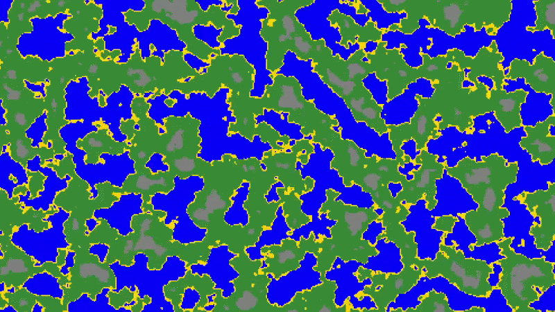

### Info

An experimental "simulation", made so that I can play around with various low-level technologies.

Features:
- Procedural 2D terrain generation
- Simple map rendering with a low-level graphics API provided by wgpu

This project was inspired by the final project assignment for CSE 210 Programming With Classes, which was to make a program that could "perform an interesting task or function." The idea I came up with was so interesting to me that I took the project way beyond the expected scope and continued working on it after the class was over. This included rewriting it from C# to Rust so that I could compile it to WASM (and as an opportunity to learn Rust).

### Setting up

Everything is standard git/Rust, except that the git hooks are stored in the `.githooks` directory. Run `git config --local core.hooksPath .githooks` when setting up a new environment.

To build the web version, install `wasm-pack` (with `cargo install wasm-pack`) and run `wasm-pack build --target web --debug`. The updated page will then be accessible from `index.html`, although you will need to use a web server to access it so that it can load the wasm file from `pkg`. (Your IDE can probably do this for you.)

